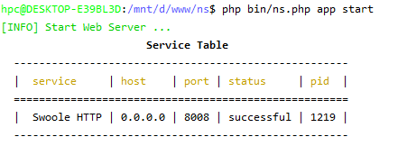

# NS Framework

## 序言
您看到的本项目现在是开发框架并非线上使用框架，上线请打包
1. [开发、使用文档](doc/main.md "文档")

## 初衷
目标：
1. 运维部署麻烦。
2. 中小公司项目尝试多变，但是很多已开发完成的模块是可以复用的，但是复用需要手动拷贝很多代码和依赖
3. 降本增效

## 待发布更新功能
1. 应用代码composer隔离
2. 应用安装依赖
3. 数据库模型
4. 数据库模型生成

## 框架说明
> 注意：框架开发后需要打包成Pahr运行文件

> 上线后请运行Phar包

1. 框架结构
2. 框架配置
3. 框架启动
4. 框架打包

## 应用说明
> 注意：应用打包成功后需要放在对应的目录

> 正在计划支持自动包依赖关系

1. 应用创建
2. 应用结构
3. 应用打包
4. 应用发布


## .env文件配置

```ini
[APP]
#是否是开发模式
DEV = true

#数据库配置
[DATABASE]
DB_DRIVER = mysql
DB_HOST = 127.0.0.1
DB_PORT = 3306
DB_DATABASE = ns
DB_USERNAME = ns
DB_PASSWORD = ns
DB_CHARSET = utf8mb4
DB_COLLATION = utf8mb4_unicode_ci
DB_PREFIX =
DB_RECONNECT = true
DB_DEBUG = true

#HTTP服务器参数配置
[HTTP]
HOST = 0.0.0.0
PORT = 8008

```

## 启动

```shell script
# Phar包启动方式
cd build
php ns.phar app start
```



## 停止

```shell script
php ns.phar app stop
```


### 引用组件参考连接
https://github.com/inhere/php-console/wiki


https://github.com/box-project/box/blob/master/doc/configuration.md


https://github.com/nikic/FastRoute
